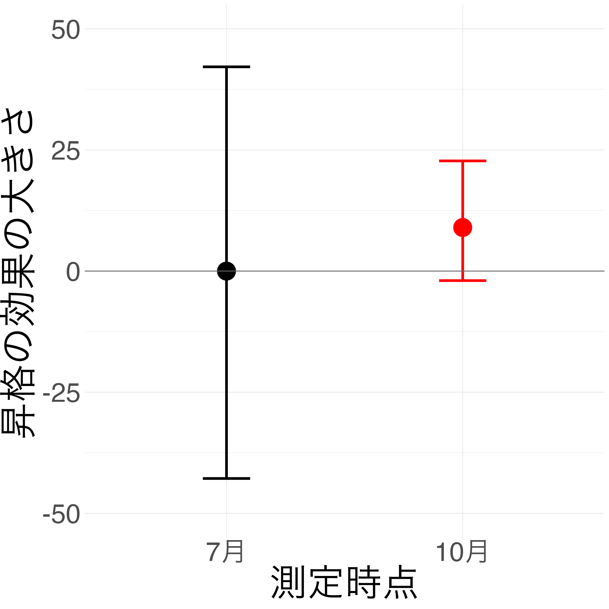
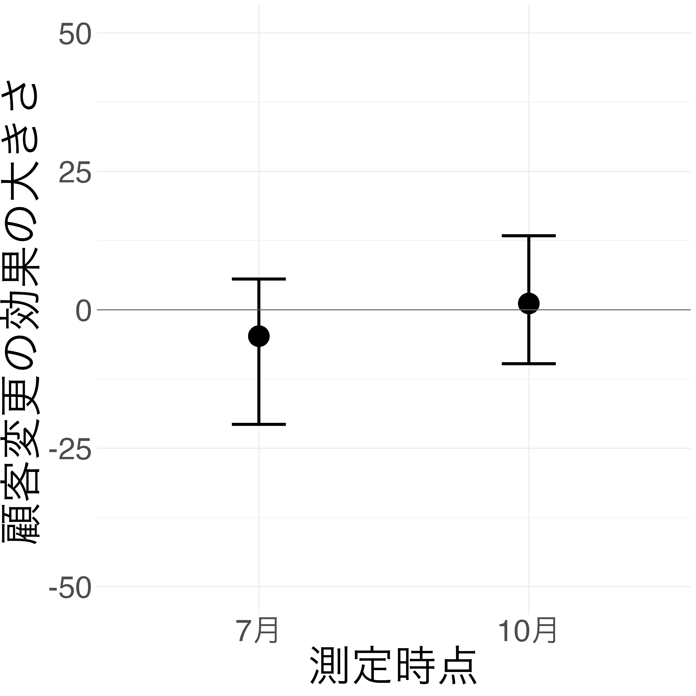
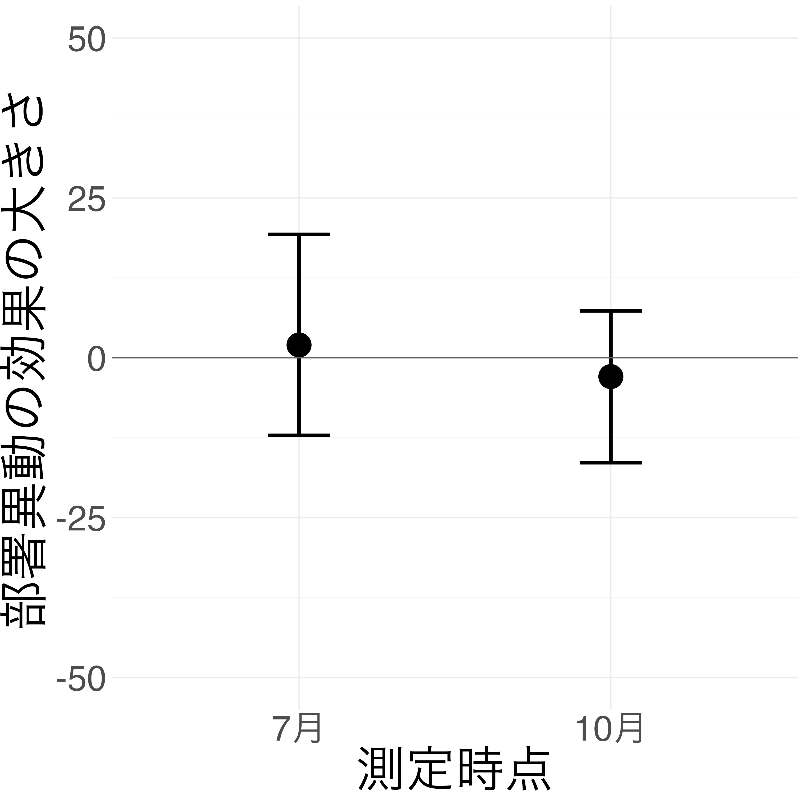

## まとめ

::: {.callout-tip appearance="simple" icon="false" title="現状の仮説"}

* 季節変動の影響が全く拭えない．
* 「職業性ストレスチェック」との関係が本当に薄い．
* ７月測定に昇進との関係は認められないが，10月測定には大きく認められる．

::: {layout-ncol=3}
{width=5cm}

{width=5cm}

{width=5cm}
:::

:::

::: {.callout-tip title="ToDo" icon="false"}

* 昇格・降格変数の本当の意味がわかったら，より正確に解析をし直す．
  * → 多分ほとんど終わった 2/27/2025
* ７月測定と10月測定と，昇進があった月からの距離が遠い．
  * → 本当に２回の測定で全然違う！ 4/30/2025

:::

::: {.callout-important appearance="simple" icon="false" title="報告点"}

* 昇格・降格の有無を教えてくれたら，プールデータに入れて縮小推定することで，「ストレス変動のうち昇格によるものの割合は何 % と推定されます」と返せる． @sec-昇降格-IRT
* 顧客変更は詳細な情報をくれたら関係が見えてくるかもしれない． @sec-昇降格
  * → 正しい昇格時期の下に再解析したら，やっぱりないかも．むしろ右肩下がりに出てきた．
  * → 顧客変更と部署異動は関係なさそう．IRT が見れない限り，平均的な寄与はなさそう．

1. 1/31/2025 ミーティングでは，昇格・降格のタイミングは４月と仮定して解析したが，「４月に昇格・降格があったものはおらず，10月に昇格・降格したものはあった」という前提に修正して解析したところ，conditional effects の傾きはむしろ大きくなった．昇格・降格の有無がストレス変動に影響を与えているという証拠はむしろ上がった．

:::

::: {.callout-note appearance="simple" icon="false" title="報告するまでは行かない発見"}

1. 結構 $0$ から分離されるくらい，３ヶ月前の残業時間が負に働いているのはなんだ？残業をすると後々楽になってストレスが下がる？？ @sec-item-response-to-OT
  1. これについては一人２回しか測定していないこともあり，不確実性が高すぎる．
2. 顧客変更の時期も入れたら結果が変わる可能性がある．

:::

## 予備的解析（2/27/2025 終了）

### 事前処理

２回繰り返しココシル測定データを R に読み込んで整理する．

```{r}
#| output: false
#| echo: false
library(readxl)
library(knitr)
# df1_result1 <- read_excel("./資料/data_Other.xlsx", sheet = "1回目結果")
# df1_covariate1 <- read_excel("./資料/data_Other.xlsx", sheet = "1回目労務管理データ")
# df1_result2 <- read_excel("./資料/data_Other.xlsx", sheet = "2回目結果")
# df1_covariate2 <- read_excel("./資料/data_Other.xlsx", sheet = "2回目労務管理データ")

# # 最初の列の名前を変更
# names(df1_result1)[1] <- "number1"
# names(df1_result2)[1] <- "number2"

# # データフレームの構造を確認
# str(df1_result1)
# str(df1_result2)

# # 「1回目キットNo」列を使って結合
# # df1_result2から、df1_result1の「1回目キットNo」と一致するnumber2を持つ行を選択して結合
# df1_result <- merge(df1_result2, df1_result1, 
#                     by.x = "1回目キットNo", 
#                     by.y = "number1", 
#                     all.x = TRUE)
df1 <- read_excel("./資料/data_Other.xlsx", sheet = "2回目結果")

```

#### データ整形とラベル変更

```{r}
#| code-fold: true
df <- df1[,c(1,2,4,116,117,118,120,121,122,137,138,129,130,131,133,134,127,128)]
colnames(df)[c(1,4,5,6,7,8,9,10,12,13,14,15,16,17)] <- c("id", "8月", "9月", "10月", "部署異動2", "昇降格", "顧客変更2", "BPCRE2", "4月", "5月", "6月", "部署異動1", "顧客変更1", "BPCRE1")
cols_to_convert <- c("部署異動1", "昇降格", "顧客変更1", "部署異動2", "顧客変更2")
df[cols_to_convert] <- lapply(df[cols_to_convert], function(x) {
  # NAを0に、"〇"または"○"を1に変換
  ifelse(is.na(x), 0, ifelse(x %in% c("〇", "○"), 1, 0))
})
kable(head(df))
```

#### 長形式化

```{r}
#| code-fold: true
library(tidyr)
df_long <- pivot_longer(
  df,
  cols = c("スコア", "1回目スコア"),
  names_to = "測定時点",
  values_to = "スコア値"
)
df_long$測定時点 <- ifelse(df_long$測定時点 == "スコア", 1, 0)  # 0: 1回目, 1: 2回目
# 部署異動1と部署異動2を統合した新しい列を作成
df_long$部署異動 <- ifelse(df_long$測定時点 == 1, 
                        df_long$部署異動2,  # 測定時点が1（2回目）なら部署異動2の値
                        df_long$部署異動1)  # 測定時点が0（1回目）なら部署異動1の値
df_long$顧客変更 <- ifelse(df_long$測定時点 == 1, 
                        df_long$顧客変更2, 
                        df_long$顧客変更1)
df_long$BPCRE <- ifelse(df_long$測定時点 == 1, 
                        df_long$BPCRE2, 
                        df_long$BPCRE1)
df_long$OT1 <- ifelse(df_long$測定時点 == 1, # OT: Overtime. 検査当月の残業時間
                        df_long$`10月`, 
                        df_long$`6月`)
df_long$OT2 <- ifelse(df_long$測定時点 == 1, # OT: Overtime. 検査前月の残業時間
                        df_long$`9月`, 
                        df_long$`5月`)
df_long$OT3 <- ifelse(df_long$測定時点 == 1, # OT: Overtime. 検査前々月の残業時間
                        df_long$`8月`, 
                        df_long$`4月`)
df_long$昇降格 <- ifelse(df_long$測定時点 == 1,
                        df_long$`昇降格`, 
                        0)
df_long <- df_long[, !names(df_long) %in% c("部署異動1", "部署異動2", "顧客変更1", "顧客変更2", "BPCRE1", "BPCRE2", "10月", "9月", "8月", "6月", "5月", "4月")]
kable(head(df_long))
```


### 残業時間は関係なさそうだが，「どれくらい遅れて出るか？」は見たい？

#### 残業時間のプロット

```{r}
#| output: false
#| code-fold: true
library(ggplot2)
library(dplyr)
# 月次データを長形式に変換
df_months <- pivot_longer(
  df,
  cols = c("4月", "5月", "6月", "8月", "9月", "10月"),
  names_to = "月",
  values_to = "値"
)

# 月を時系列順に並べるためのファクター化
df_months$月 <- factor(df_months$月, 
                      levels = c("4月", "5月", "6月", "8月", "9月", "10月"),
                      ordered = TRUE)
```
```{r}
#| fig-cap: "月次残業時間数の推移"
#| code-fold: true
#| warning: false
ggplot(df_months, aes(x = 月, y = 値, group = id, color = factor(id))) +
  geom_line() +
  geom_point() +
  theme_minimal() +
  labs(title = "detention hours",
       x = "month",
       y = "value",
       color = "ID") +
  theme(legend.position = "none")  # IDが多い場合は凡例を非表示に
```

#### 残業時間の中央値のプロット

```{r}
#| code-fold: true
#| fig-cap: "月次残業時間数の中央値の推移"
#| warning: false
# 各月の中央値を計算
monthly_medians <- df_months %>%
  group_by(月) %>%
  summarize(中央値 = median(値, na.rm = TRUE))

# 中央値のプロット
ggplot(monthly_medians, aes(x = 月, y = 中央値, group = 1)) +
  geom_line(size = 1.5, color = "red") +
  geom_point(size = 3, color = "red") +
  theme_minimal() +
  labs(title = "median trend",
       x = "month",
       y = "median")
```

#### ３ヶ月前の残業時間と負の相関 {#sec-item-response-to-OT}

結構高確率で３ヶ月前の残業時間が負に働いているのはなんだ？残業をすると後々楽になってストレスが下がる？？

```{r}
#| output: false
library(brms)
formula <- bf(スコア値 ~ 1+OT1+OT2+OT3+測定時点)
fit <- brm(formula, data = df_long, chains = 4, cores = 4)
```

```{r}
#| echo: false
plot(fit)
summary(fit)
```

```{r}
#| output: false
library(brms)
formula <- bf(スコア値 ~ (1+OT1+OT2+OT3+測定時点|id))
fit <- brm(formula, data = df_long, chains = 4, cores = 4)
```

```{r}
#| echo: false
#| fig-cap: "OT1の被験者毎の係数"
library(ggplot2)
ranef_OT1 <- ranef(fit)$id
posterior_means <- ranef_OT1[,1,"OT1"]
lower_bounds <- ranef_OT1[,3,"OT1"]
upper_bounds <- ranef_OT1[,4,"OT1"]
plot_df_OT1 <- data.frame(
  item = rownames(ranef_OT1),
  mean = posterior_means,
  lower = lower_bounds,
  upper = upper_bounds
)
# 昇降格情報を追加
# item名からIDを抽出（"id:数字"の形式から数字部分を取り出す）
plot_df_OT1$id <- as.numeric(gsub("id:", "", plot_df_OT1$item))

p_OT1 <- ggplot(plot_df_OT1, aes(x = mean, y = item)) +
  geom_point() +
  geom_errorbar(aes(xmin = lower, xmax = upper), width = 0.2) +
  scale_color_manual(values = c("OT1あり" = "red", "OT1なし" = "black")) +
  theme(axis.text.x = element_text(angle = 90, hjust = 1)) +
  labs(title = "Posterior Means and 95% Credible Intervals for OT1",
       x = "Posterior Estimate",
       y = "Item")
p_OT1
```

```{r}
#| echo: false
#| fig-cap: "OT2の被験者毎の係数"
library(ggplot2)
ranef_OT2 <- ranef(fit)$id
posterior_means <- ranef_OT2[,1,"OT2"]
lower_bounds <- ranef_OT2[,3,"OT2"]
upper_bounds <- ranef_OT2[,4,"OT2"]
plot_df_OT2 <- data.frame(
  item = rownames(ranef_OT2),
  mean = posterior_means,
  lower = lower_bounds,
  upper = upper_bounds
)
# 昇降格情報を追加
# item名からIDを抽出（"id:数字"の形式から数字部分を取り出す）
plot_df_OT2$id <- as.numeric(gsub("id:", "", plot_df_OT2$item))

p_OT2 <- ggplot(plot_df_OT2, aes(x = mean, y = item)) +
  geom_point() +
  geom_errorbar(aes(xmin = lower, xmax = upper), width = 0.2) +
  scale_color_manual(values = c("OT2あり" = "red", "OT2なし" = "black")) +
  theme(axis.text.x = element_text(angle = 90, hjust = 1)) +
  labs(title = "Posterior Means and 95% Credible Intervals for OT2",
       x = "Posterior Estimate",
       y = "Item")
p_OT2
```

```{r}
#| echo: false
#| fig-cap: "OT3の被験者毎の係数"
library(ggplot2)
ranef_OT3 <- ranef(fit)$id
posterior_means <- ranef_OT3[,1,"OT3"]
lower_bounds <- ranef_OT3[,3,"OT3"]
upper_bounds <- ranef_OT3[,4,"OT3"]
plot_df_OT3 <- data.frame(
  item = rownames(ranef_OT3),
  mean = posterior_means,
  lower = lower_bounds,
  upper = upper_bounds
)
# 昇降格情報を追加
# item名からIDを抽出（"id:数字"の形式から数字部分を取り出す）
plot_df_OT3$id <- as.numeric(gsub("id:", "", plot_df_OT3$item))

p_OT3 <- ggplot(plot_df_OT3, aes(x = mean, y = item)) +
  geom_point() +
  geom_errorbar(aes(xmin = lower, xmax = upper), width = 0.2) +
  scale_color_manual(values = c("OT3あり" = "red", "OT3なし" = "black")) +
  theme(axis.text.x = element_text(angle = 90, hjust = 1)) +
  labs(title = "Posterior Means and 95% Credible Intervals for OT3",
       x = "Posterior Estimate",
       y = "Item")
p_OT3
```

人によっては強く，過去の残業時間がストレスに影響を及ぼしている可能性があるが，エラーバーが長すぎる．やっぱ一人２回しか測定してないからね．

### 主解析：顧客変更の影響 {#sec-昇降格}

::: {#cocosiru1-listing}
:::

```{r}
#| output: false
library(brms)
formula <- bf(スコア値 ~ (1|id) + 測定時点 + 顧客変更 + 部署異動 + 昇降格)
fit <- brm(formula, data = df_long, chains = 4, cores = 4)
```

```{r}
#| echo: false
summary(fit)
plot(fit)
```

```{r}
#| echo: false
#| layout-ncol: 2
#| layout-nrow: 2
conditional_effects(fit, "測定時点")
conditional_effects(fit, "昇降格")
conditional_effects(fit, "顧客変更")
conditional_effects(fit, "部署異動")
```


### 属人的影響への考察 {#sec-昇降格-IRT}

::: {.callout-important title="昇進の影響について" collapse="true" icon="false"}

> 実際の心理学的研究でも、中間管理職への昇進はストレス要因となることが示唆されています。吉原らによる企業管理職115名の調査では、「昇進直後は当人もストレス自覚はあるものの、エゴグラム（自我状態診断）上のFree Child（自由な子ども）の得点が昇進後に有意に上昇する」と報告されています。こ​れは、昇進によるプレッシャーを感じつつも、新たな役割の中で創意工夫や自己裁量が増しストレス対処スキルが向上したことを示唆する結果でした​。つまり、昇進は心理的緊張を高める反面、モチベーションの向上や成長によってストレスへの対処力が養われる側面もあると言えます。

昇進の影響は遅れて出るのだろうか？昇進に適応できた群と出来ていない群に分離できるのだろうか？

昇進がストレッサーになることを，いくらか定性的に論じた論文はある [@石川浩二+2002]．

> 昇進によって本人のモチベーションが上がり「良いストレス（eustress）」と感じている場合でも、身体的には交感神経亢進や活性酸素増加といった反応が起きるためUBPは増加すると考えられます。ポジティブな心理要因がある程度ストレスを相殺したとしても、生体指標としては昇進後しばらくは酸化ストレスが高まりやすい**と見るのが妥当です。

:::

```{r}
#| output: false
library(brms)
formula <- bf(スコア値 ~ 測定時点 + 顧客変更 + 部署異動 + (1+昇降格|id))
fit <- brm(formula, data = df_long, chains = 4, cores = 4)
```

```{r}
#| echo: false
library(ggplot2)
ranef_昇降格 <- ranef(fit)$id
posterior_means <- ranef_昇降格[,1,2]
lower_bounds <- ranef_昇降格[,3,2]
upper_bounds <- ranef_昇降格[,4,2]
plot_df_昇降格 <- data.frame(
  item = rownames(ranef_昇降格),
  mean = posterior_means,
  lower = lower_bounds,
  upper = upper_bounds
)
# 昇降格情報を追加
# item名からIDを抽出（"id:数字"の形式から数字部分を取り出す）
plot_df_昇降格$id <- as.numeric(gsub("id:", "", plot_df_昇降格$item))

# 元のデータフレームから各IDの昇降格情報を取得
plot_df_昇降格$昇降格 <- df_long$昇降格[match(plot_df_昇降格$id, df_long$id)]
# 重複を削除（同じIDが複数回出現する場合）
plot_df_昇降格$昇降格 <- plot_df_昇降格$昇降格[!duplicated(plot_df_昇降格$id)]

# 昇降格の値に基づいて色を設定
plot_df_昇降格$color <- ifelse(plot_df_昇降格$昇降格 == 1, "昇降格あり", "昇降格なし")

p_昇降格 <- ggplot(plot_df_昇降格, aes(x = mean, y = item, color = color)) +
  geom_point() +
  geom_errorbar(aes(xmin = lower, xmax = upper), width = 0.2) +
  scale_color_manual(values = c("昇降格あり" = "red", "昇降格なし" = "black")) +
  theme(axis.text.x = element_text(angle = 90, hjust = 1)) +
  labs(title = "Posterior Means and 95% Credible Intervals for Items",
       x = "Posterior Estimate",
       y = "Item",
       color = "")
p_昇降格
```

人毎に係数が違う可能性は十分にある．どういう解析ができそうだろうか？

### ストレスの季節間変動に関する関連文献

::: {.callout-tip appearance="simple" icon="false"}

* 単純な季節間変動を見ていることになるだろうが，そのうちの半分以上は職場環境由来だろう．
* 部署異動は完全に何も見られないが，顧客変更は若干の影響を認める．**顧客変更の時期なども考慮に入れたら変わる可能性がある**．
* ５月初め時点でストレスチェックをすると，高い人とそうでない人で顕著に差が出る可能性がある．６月は大抵，収束した後の場合が多い．

:::

::: {.callout-important title="季節の外的影響について" collapse="true" icon="false"}

> ある研究では「冬と比較して、夏の方が唾液中のコルチゾール値が全体的に高く、日内リズムのピーク時刻も遅れる」ことが示されました​．実際、ポーランドで若年女性を対象に行われた研究では、**夏季（6月）**にコルチゾールが有意に上昇し、炎症マーカーIL-6には差がなかったと報告されています​。この研究は「寒い冬にストレスホルモンが増える」という従来のイメージに反し、「夏の方がコルチゾールレベルが高い」という興味深い結果となりました​。研究者らは、暑熱環境が肉体的ストレスとなりコルチゾール分泌を高めた可能性を指摘しています。

> かし、バイオピリンなど酸化ストレス指標については季節変動に関するデータはまだ限られているのが現状です。例えば大阪公立大学の研究では、助産師を対象に尿中バイオピリンと心理ストレス尺度を用いた横断研究を行いましたが​、この中で著者らは「今後は測定時期や背景要因の影響も考慮する必要がある」と述べています​。これは、ストレス指標としてバイオピリンを用いる際に、季節や時期による基準値の揺らぎにも注意すべきことを示唆しています。実際、酸化ストレス指標である8-ヒドロキシデオキシグアノシン(8OHdG)については、学生を対象とした研究でストレスが高い年度に上昇し、翌年度に低下する（ストレス軽減で酸化ダメージが減る）傾向が報告されています​。季節変動そのものを直接検証した例ではありませんが、ストレス負荷が変われば酸化ストレスマーカーも変動することが示唆されており、季節要因による影響も十分考えられます。

> また下期の開始や人事異動など職場の変化要因が多く、心理的ストレスが増えやすい。実際に炎症指標（CRP）が秋に高まったデータもある [@Itoh+2012]​。

:::

研究 [@Itoh+2012] は３人しか見ていないが，同じく日本の企業労働者で高感度 CRP を測定した研究であり，2月よりも10月の方が CRP が高いという結果を示している．

![[Fig.1 from @Itoh+2012 p.62]](資料/ref1.png)

## Archived

### プリメディカのココシル測定

被験者は 43 名で，測定下限未満だったものが 6 名．よってデータフレームは 37 行．

```{r}
#| output: false
library(readxl)
df2 <- read_excel("./資料/data_PMC.xlsx")
```